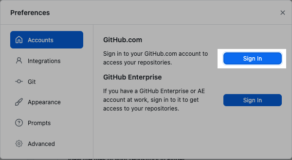
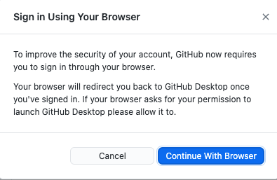

# Cloning and Forking "The Vault" Repository into your computer 

## Introduction

Before we dive into the steps you need to follow in order to clone or fork “the-vault” repository allow me to explain very briefly what is the difference between cloning and forking a repository. 

**If you already know the difference you may safely skip this part!**

The short answer is: forking the repository means that you create an independent copy of the repository, on the other hand cloning will create a linked copy.

The long answer: when the git repository is cloned, the original repository remains shared between all the developers who have contributed and will continue to update as other developers push new changes and pull new updates. For example, if you cloned a repository yesterday and today a developer changes or adds something into this repository, by executing the command “git pull” in your terminal, the code in your computer will be updated as well. 

In contrast, when the git repository is forked, it will create a completely new copy of the original repository. And after that point the forked repository will completely be under your control. When some other developer updates or changes something in the original repository, your repo will remain unaffected. Same thing if you change something that will be obvious only to you, unless you give access.

In conclusion cloning is used by active developers who constantly contribute to the project and have full access, and forking is used by developers who don’t have access to update the original repository but want to suggest some change or update. Or you fork the repo and develop it yourself as you see fit from that time on, as a hobby maybe or for whatever reason.

## Cloning 
1. To clone “The Vault” repository into your computer first visit the following URL: https://github.com/littlefish-foundation/the-vault 
2. The next steps are illustrated in the image below. (This illustrates the cloning of the repository using HTTPS which is the most popular and easy way.)

3. Open the terminal on your mac (or cmd in windows machines). The first thing you need to do in this instance is to change the directory that you want the repository to be saved. In order to achieve this, first check your current directory. In mac you can do this by typing “ls” on the terminal (in windows you can perform the same command by typing “dir”). This command will show all the directories listed under your current directory. Check the image: 
*In case you do not see any of the main directories such as Desktop or Downloads but instead you see the names of folders that you have created, it means that you are inside one of these directories, you can go back by typing  “cd ..” (same for mac and windows). Then type “ls” for mac (“dir” for windows) and check again.*

4. That being said, let’s say that I want to save the repository on a folder named “The Vault” that I have previously created on my desktop. For this I type 
“cd desktop/The Vault ”. Check the image: 

5. On the next step you need to type “git clone + the URL you copied from step 2” (plus should not be typed). And then press Return for mac or Enter for Windows.After this command the repository starts downloading into the folder that you chose. 
**Important:** If you get some kind of error message saying that it doesn't recognize the git command, it means that git is not installed in your machine. To learn more for this check out the following link: https://github.com/git-guides/install-git 

***CONGRATULATIONS  YOU HAVE SUCCESSFULLY CLONED THE REPOSITORY ON YOU COMPUTER.***

## Forking 
1. To fork “The Vault” repository into your computer first visit the following URL: https://github.com/littlefish-foundation/the-vault 
2. The next steps are illustrated in the image below. Now at this point it means that you have successfully created a copy of the original repository in your github profile. However, to be able to make changes from in this newly forked repository you need to Clone it following the same steps described on the cloning process above.

## Creating a Branch only for You
Before making any changes to "The Vault" repository, it is important to create a new branch and check it out. Branching will make it significantly easier when you contribute again in the future by following ["Github Flow"](https://docs.github.com/en/get-started/quickstart/github-flow#following-github-flow)(more on Github Flow) since changes are kept in their own branch.
The entire process that you need to follow after cloning the repository is illustrated below:
1. Navigate to the directory where the cloned repository is located by using "cd" command.
2. Create a new branch by using the command `git branch given-name` change `given-name` with whatever name you want to give to your branch.
3. Check it out by typing `git checkout given-name`. 

## Making Changes and Pushing them to Github
Now that you have created the branch, go ahead and open the repository on your favorite source-code editor (vscode for example) and add whatever information that you want to contribute. After you are done, save the changes and go back to the terminal and follow the steps illustrated in the image below:

#### Note: In case you get an authentication error after command #3.
Don worry nothing has been lost. You can fix it in a few steps. First if you know your git user name and email you may skip the first step. 

1. Set username and email by entering the following commands : 
`git config --global user.name "Your_username"` press enter
`git config --global user.email "Your_Primary_Email_in_Github"`

*if you are not sure of your primary email address in github visit this link: https://github.com/settings/emails*

2. Type the following command to set your authentication credential to the git Remote URI:
`git remote set-url origin https://username@github.com/username/the-vault.git`

3. Now go ahead and type the third command from the image above again:
`git push --set-upstream origin dev-link-forge`

*If the console asks for a password after this step, go to the following link https://github.com/settings/tokens, click on "Generate new token (classic)", fill out a simple form, copy the generated token and paste it as password in terminal*

## Making a Pull Request
Now you are just a few clicks away from proposing your changes to the owner of the original repository.
1. Go to "the-vault" repository in your Github profile. What you will see should look something like the image below.
 

3. Go on and click on the "Compare & Pull request". The next page would be: 

3. Click on the "Create pull request" button. And you are done. Congratulations !

## Github Desktop

You can download the Github Desktop App from the following link: https://desktop.github.com/

After downloading and installing, you need to authenticate it with your github account. Open preferences, click on sign in. This will redirect you to your github account from your default browser. 

Assuming that you have forked the repository in your github account (the first two steps of the forking section), you now need to clone it in your computer. 

To achieve this first you need to go to **file** from the menu bar and from there click on **Clone Repository...**. This command will open a modal similar to the one below, which will show all the repositories found in your github profile.

From here select the vault (same as the illustration), choose a local path (where do you want this repository to be downloaded), and finally click on clone button.

This indicates that the repository is being downloaded.

When this process is done you are set. Go on and open the repository from vscode, and make some changes. Than return to github desktop which will recognize all changes automatically. Look the image below:

As for the next step, in the bottom left corner write a short summary of your actions and click **commit to main**.

Now that you have committed your changes, you need to push them online. Look at the image below:

Click on **Push Origin** and you are done. The next step is to create a pull request from your github profile. *Described on the previous section*. 

