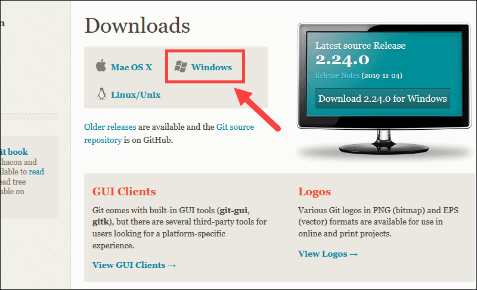
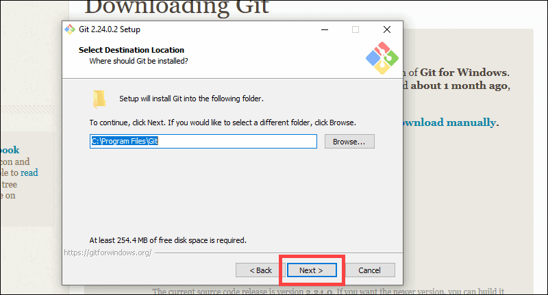
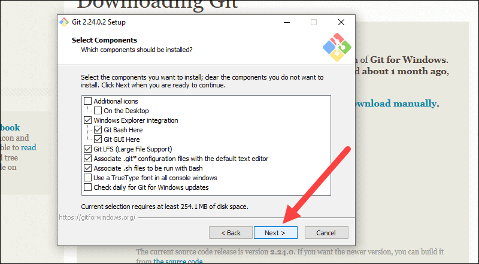
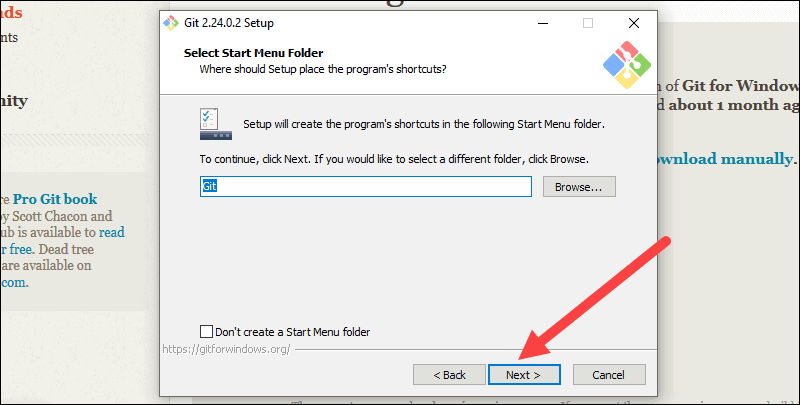
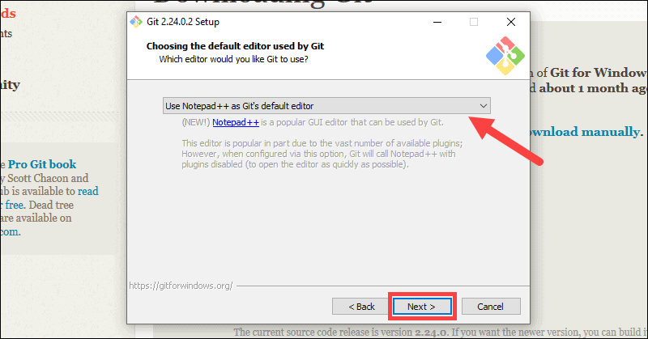
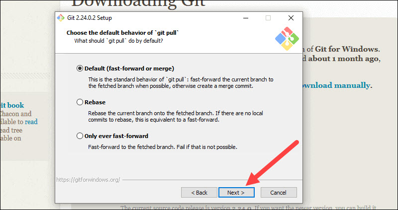
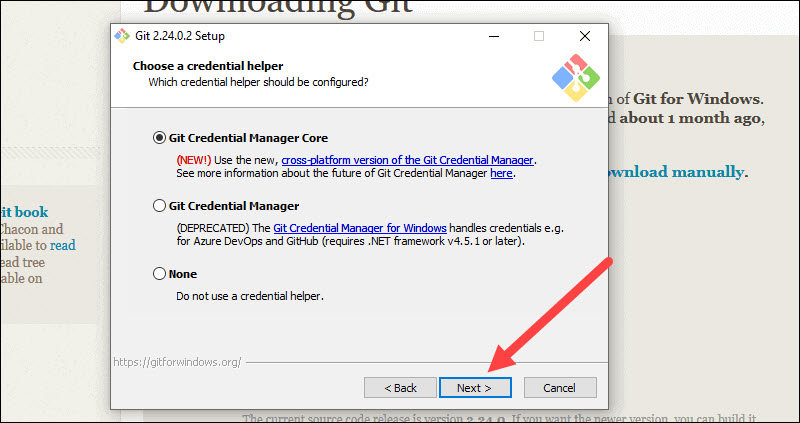
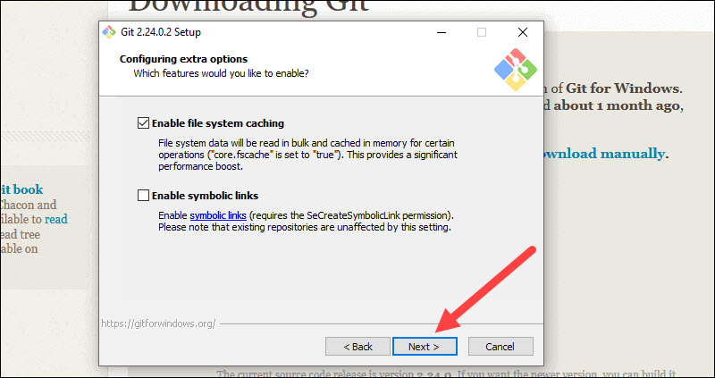
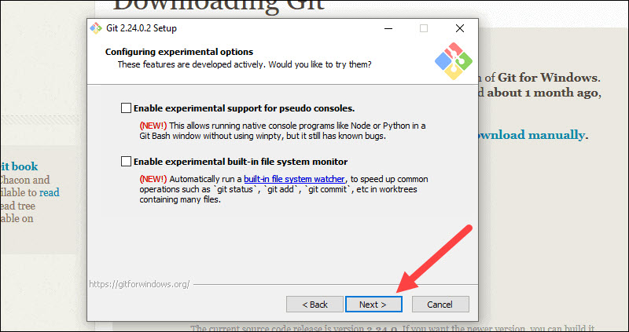
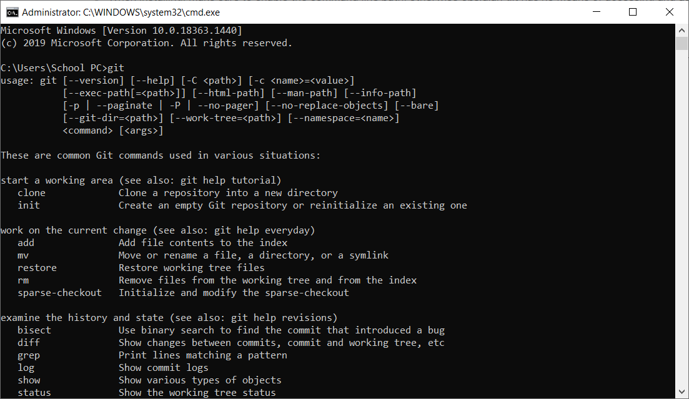

# An Illustrated Step by Step Guide on How to Install Git in Windows

## Download Git for Windows
**Step#1.** Browse to the official Git website: https://git-scm.com/downloads.

**Step#2.** Click the download link for Windows and allow the download to complete. 

## Extract and Launch Git Installer

**Step#3.** Browse to the download location (or use the download shortcut in your browser). Double-click the file to extract and launch the installer. 

**Step#4.** Allow the app to make changes to your device by clicking **Yes** on the User Account Control dialog that opens. 

**Step#5.** Review the GNU General Public License, and when you’re ready to install, click **Next**. 

**Step#6.** The installer will ask you for an installation location. Leave the default, unless you have reason to change it, and click **Next**. 

**Step#7.** A component selection screen will appear. Leave the defaults unless you have a specific need to change them and click **Next**. 

**Step#8.** The installer will offer to create a start menu folder. Simply click **Next**. 

**Step#9.** Select a text editor you’d like to use with Git. Use the drop-down menu to select Notepad++ (or whichever text editor you prefer) and click **Next**. 

**Step#10.** The next step allows you to choose a different name for your initial branch. The default is 'master.' Unless you're working in a team that requires a different name, leave the default option and click **Next**. 

**Step#11.** This installation step allows you to change the **PATH environment**. The **PATH** is the default set of directories included when you run a command from the command line. Leave this on the middle (recommended) selection and click **Next**. 

## Server Certificates, Line Endings and Terminal Emulators

**Step#12.** The installer now asks which SSH client you want Git to use. Git already comes with its own SSH client, so if you don't need a specific one, leave the default option and click **Next**. 

**Step#13.** The next option relates to server certificates. Most users should use the default. If you’re working in an Active Directory environment, you may need to switch to Windows Store certificates. Click **Next**. 

**Step#14.** The next selection converts line endings. It is recommended that you leave the default selection. This relates to the way data is formatted and changing this option may cause problems. Click **Next**. 

**Step#15.** Choose the terminal emulator you want to use. The default MinTTY is recommended, for its features. Click **Next**. 

**Step#16.** The installer now asks what the **`git pull`** command should do. The default option is recommended unless you specifically need to change its behavior. Click **Next** to continue with the installation. 

**Step#17.** Next you should choose which credential helper to use. Git uses credential helpers to fetch or save credentials. Leave the default option as it is the most stable one, and click **Next**. 

## Additional Customization Options

**Step#18.** The default options are recommended, however this step allows you to decide which extra option you would like to enable. If you use symbolic links, which are like shortcuts for the command line, tick the box. Click **Next**. 

**Step#19.** Depending on the version of Git you’re installing, it may offer to install experimental features. At the time this article was written, the options to include support for pseudo controls and a built-in file system monitor were offered. Unless you are feeling adventurous, leave them unchecked and click **Install**. 

## Complete Git Installation Process

**Step#20.** Once the installation is complete, tick the boxes to view the Release Notes or Launch Git Bash, then click **Finish**. 

---
## Check Installation Status

Check if git was installed successfully by opening the command line interface ( **`windows + r`** , **`cmd`**, **`enter`** ) and inputting **`git`** and pressing **`enter`**.

If git has been successfully installed, the output will be something similar to the one in the image below:

