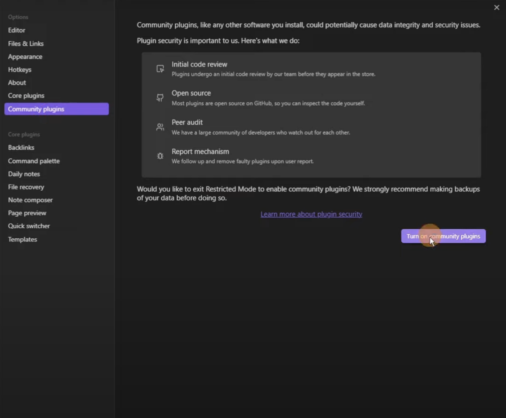
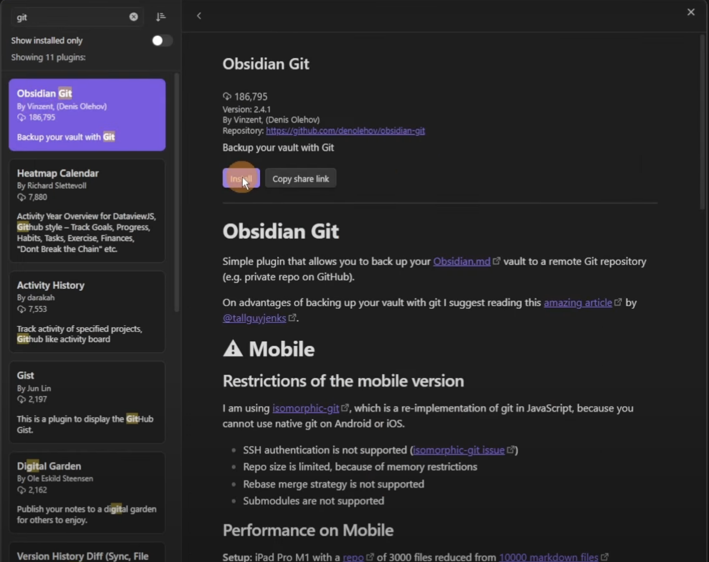
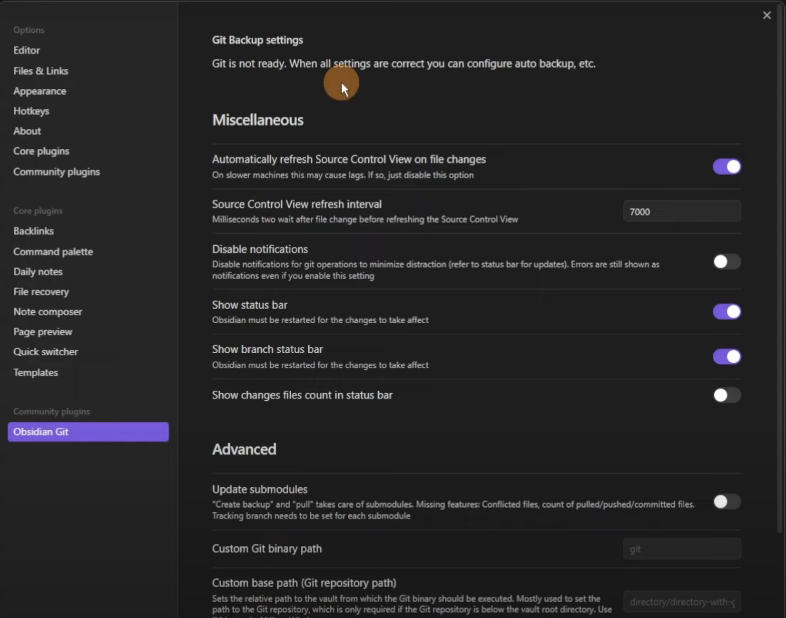
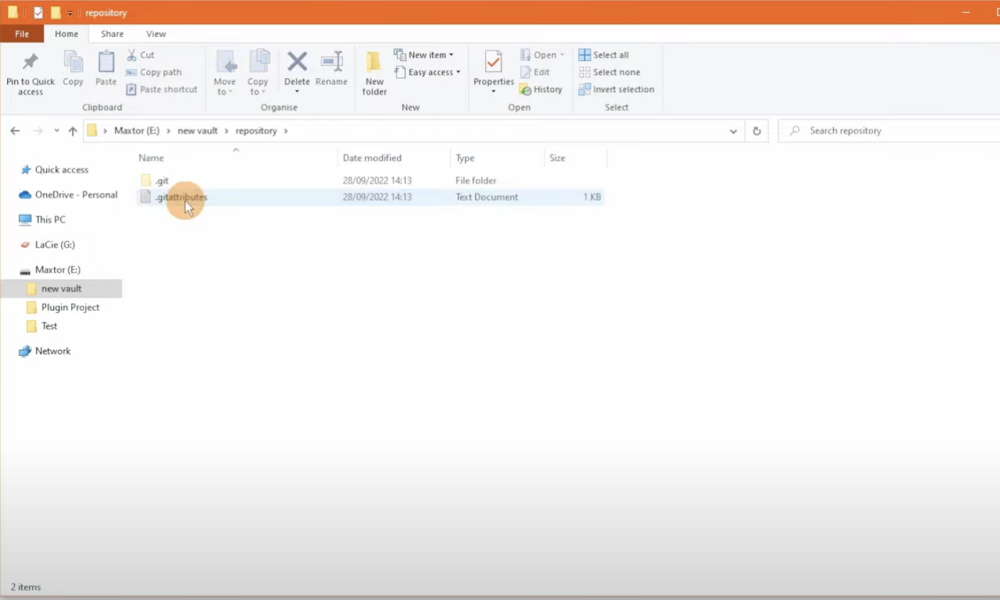
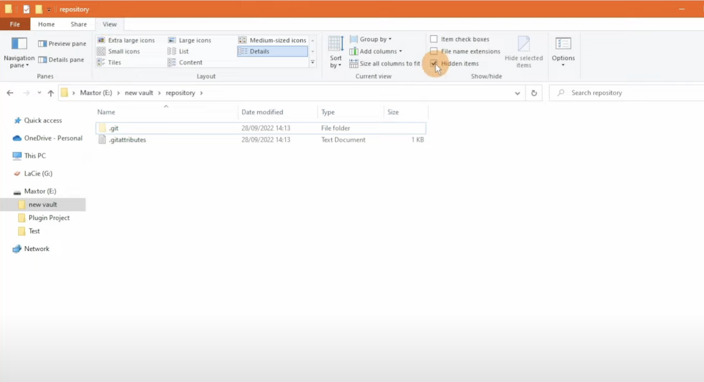
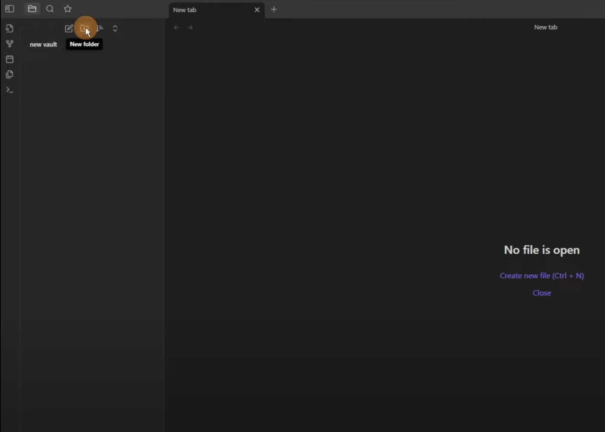
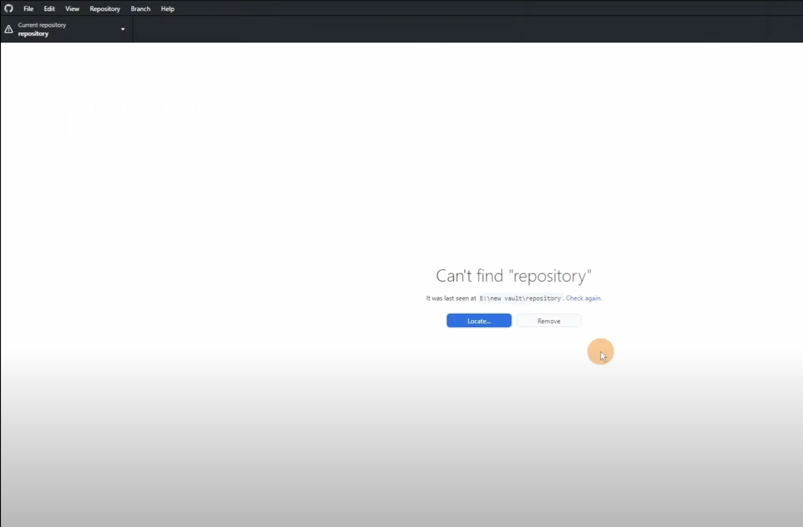
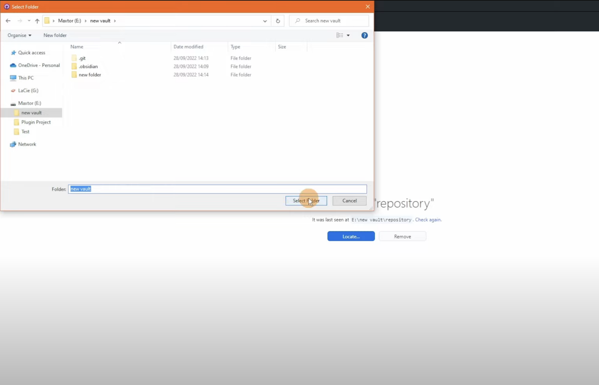
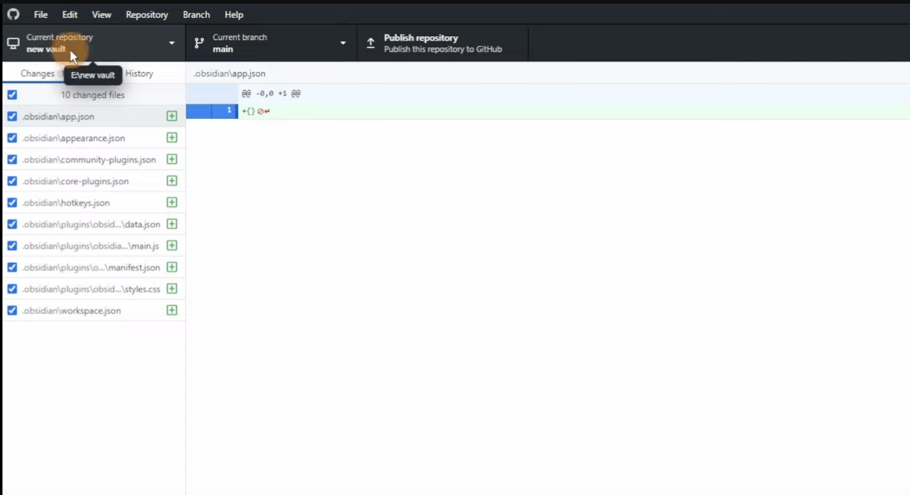
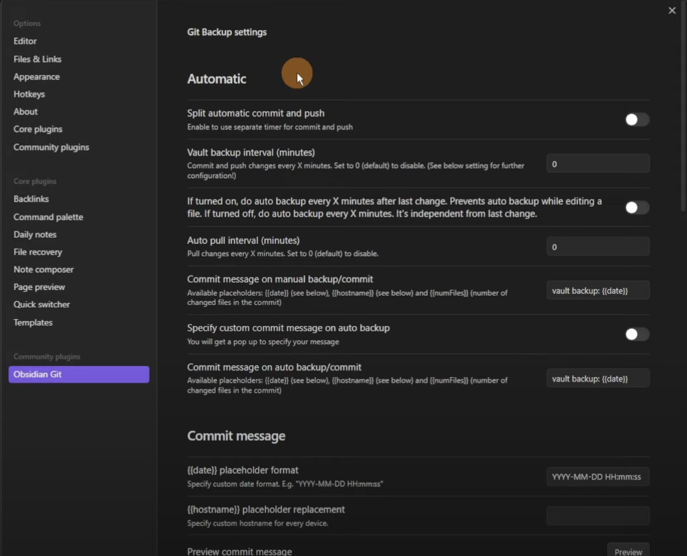

# Obsidian-Github Integration in Windows

Backing up your vault with git and having it set up as a repository on GitHub has two main benefits, first, it allows you to keep all your personal notes, configs and workspace settings in sync with all of your devices. And second, it makes collaboration on shared vaults (multiple contributors) more convenient. With git integration in Obsidian it is easier to contribute and keep track of other members' contributions. 

In this document, I will explain step by step how you can make this integration in your Windows computer.

### Step#1. Git Installation 
First, verify if git is already installed in your computer. To do this, open the command line interface ( **`windows + r`** , **`cmd`**, **`enter`** ) and type **`git --version`** and than press **`enter`**. 
If the returned message is `'git' is not recognized as an internal or external command, operable program or batch file.` it means that git is not installed and you need to install it. 

In this document [[Install Git for Windows]], you may find a detailed step by step guide on how to successfully install git in your Windows computer.

### Step#2. Download and Install Obsidian 

You can download Obsidian from the following link; [https://obsidian.md/download](https://obsidian.md/download)

After finishing installing the app, you need to create a new vault. The process is illustrated in the images below:

Next, click on the settings icon in bottom left corner and from there select Community Plugins and then Turn on community plugins.

In the screen that appears, click on Browse and then type Obsidian Git in the search box. After find the Obsidian Git plugin, click on the install button.

Now return one page back and you will see that Obsidian Git has been installed, but there is a message that says that it is not ready yet.

The reason for this warning is that you need to a git history folder, before you can do anything with Obsidian. 

Now go to the directory where you chose to place the vault (beginning of step#2.) from there click on `new vault` > `.obsidian` > `plugins`. Inside plugins you will see an "obsidian-git" folder, and ".git" folder is missing. Now in **Step#3.** we will create this folder and this will make our integration functional. 

### Step#3. Download and Install Github Desktop and Prepare for Integration with Obsidian

You can find the installation file of the GitHub Desktop in the following link: [https://desktop.github.com/](https://desktop.github.com/)

After finishing installing, open the app, go to files on the top left corner and click on `New repository...`.

This new repository is going to be the folder that you can use as your Obsidian Vault.

Now if you go again to the location of "new vault", inside you will see a new folder named `repository`. And inside of it you will see the ".git" folder created by Github Desktop.

".git" folders are hidden items so if you don't see it as shown in the image above, click on the view tab from the top left corner and click on the box labeled as "Hidden Items".

Now that you can see both ".git" folder and ".gitattributes" Text Document inside the repository folder, select both and cut (CTRL+X). 
Go back to the `new vault` folder, and paste (CTRL+V).

Now from `new vault` folder, you can delete the folder named "repository" since it is not doing anything. Now there is one remaining step and you will be set.

### Step#4. Final Adjustments  

Return to the Obsidian app and try to create a new folder. Click on the folder icon on the top left corner of the screen.

After you create the empty folder, go back to Github Desktop. Here you will see a message saying "Can't find `repository`" or whatever you named your repository created from Github Desktop in the beginning of **Step#3**.

Click on `Locate...` button and from there select `new folder` to replace the `repository`. Follow the same steps as illustrated in the image below.

Return to Github Desktop, and now you will see that `new vault` is listed as the Current Repository.
 

Now you are all set. Go on and add some new components on the Obsidian, commit the changes and then Publish repository. When you Publish the repository, everything inside `new vault` in your computer will be uploaded to Github online. 

One last thing, just to verify the process. In **Step#2** we mentioned that even though the plugin installed successfully, there was a message "Git is not ready" under `Git Backup Settings`. If now, you go back to settings in Obsidian and click on "Obsidian Git" from the bottom left, there will be no warning message under `Git Backup Settings`.

